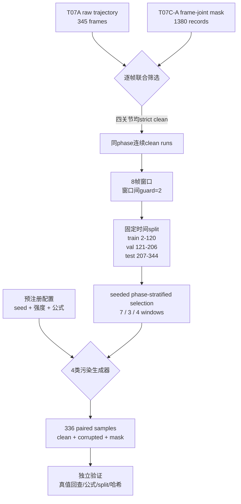

# T07C-B2 Synthetic Corruption Dataset Guide

## 1. 目标与边界

真实异常帧没有同步运动捕捉真值。只看视频可以判断OpenPose“错了”，但通常不能精确给出真实关节坐标，因此不能直接计算恢复RMSE。T07C-B2从严格干净的raw轨迹窗口出发，人为施加参数已知的污染，得到配对数据：

\[
(\text{clean ground truth }x_{1:L},\ \text{corrupted observation }z_{1:L})
\]

后续方法只能把`corrupted_trajectory_*`作为输入，再与隐藏的`clean_trajectory_*`比较。本阶段只生成数据，不运行Savitzky-Golay、One Euro、Kalman或任何恢复方法。

## 2. 数据流图



## 3. 哪些帧能作为干净真值

窗口内每一帧的Neck、RShoulder、RElbow、RWrist必须同时满足：

1. `raw_observation_valid=true`；
2. `selected_downstream_source=raw`；
3. `repaired_observation_available=false`；
4. `corruption_type=valid`；
5. `source_event_ids=[]`；
6. 8帧属于同一个动作阶段。

这是比“target joint坐标非空”更严格的条件。即使目标是RWrist，RElbow或RShoulder存在异常也会排除整个窗口，因为后续骨骼约束方法可能使用这些参考关节。

特别注意：T07B人工接受的7个RWrist repair可用于真实下游轨迹，但不能作为本轮合成真值。否则会用一个插值估计值评价另一个恢复算法，产生循环论证。

## 4. 参数集中配置

唯一参数源是：

`configs/dataset/t07c_b2_synthetic_corruption.json`

关键配置：

| 参数 | 值 | 含义 |
|---|---:|---|
| `random_seed` | 20260714 | 全局复现种子 |
| `window_length_frames` | 8 | 每个clean窗口长度 |
| `guard_frames_between_windows` | 2 | 相邻窗口保护间隔 |
| split ranges | 2-120 / 121-206 / 207-344 | 不重叠时间隔离，边界与phase对齐 |
| selected windows | 7 / 3 / 4 | train/val/test窗口数 |
| corruption scale | 窗口肩宽中位数 | 使像素扰动随人物尺度变化 |

配置文件在首次生成前SHA-256为：

`35785fabb07bde8da38ed11bea0968e49e6f233e2ae2526c9e311778d8256055`

如果修改配置，必须视为新的dataset version，不能继续沿用本次结果。

## 5. 四种污染模型

### 5.1 Gaussian random noise

模拟OpenPose在可见关节附近的逐帧随机抖动：

\[
z_t=x_t+\epsilon_t,\qquad
\epsilon_t\sim\mathcal{N}\left(0,(\sigma s)^2I_2\right)
\]

其中`s`是clean窗口肩宽中位数。低/中/高强度的`σ`为0.01/0.03/0.06肩宽。8帧全部被加噪，但clean值完整保留。

### 5.2 Burst jump

模拟关键点短暂吸附到错误图像区域：

\[
z_t=\begin{cases}
x_t+m s u,&t\in B\\
x_t,&t\notin B
\end{cases},\qquad \lVert u\rVert_2=1
\]

`B`是内部连续区间，两侧至少保留一帧clean上下文。低/中/高分别使用0.08/0.16/0.30肩宽，持续1/2/3帧。

伪代码：

```text
start <- seeded interior position
u <- seeded random unit direction
offset <- magnitude * median_shoulder_width * u
for t in start .. start + duration - 1:
    corrupted[t] <- clean[t] + offset
```

### 5.3 Continuous drift

模拟遮挡加重时关键点逐渐偏离真实关节：

\[
z_{t_k}=x_{t_k}+\alpha_k m s u,qquad
\alpha_k=\frac{k+1}{L},\ k=0,\ldots,L-1
\]

污染固定作用于8帧窗口的6个内部帧，首尾保持clean上下文。最大幅度低/中/高为0.05/0.12/0.25肩宽。

### 5.4 Short missing

模拟OpenPose因短时遮挡完全不输出关节：

\[
z_t=\begin{cases}
\text{null},&t\in M\\
x_t,&t\notin M
\end{cases}
\]

低/中/高缺口长度为1/2/4帧，缺口两侧各保留至少一帧观测。`null`不能写成`[0,0]`，因为零坐标仍是一个数值观测。

## 6. 随机种子与数据隔离

生成器不使用Python内置`hash()`，因为其结果可能随进程变化。每条样本的种子为：

```text
uint64(SHA256(global_seed | source_window_id | joint | corruption | intensity)[0:8])
```

这样即使调整遍历实现，同一语义样本仍能得到相同随机方向和位置。

数据split按固定时间范围隔离，所有由同一clean窗口生成的24个变体只能属于一个split。不能把同一窗口的Gaussian样本放train、missing样本放test，否则模型会在train见过test的真实运动轨迹。

本次源帧数：train 56、val 24、test 32；任意两个split的源帧交集为空。

## 7. 关键函数导读

### `strict_clean_frame`

同时检查四个参考关节的T07C-A状态。它是防止真实异常帧进入ground truth的主要门槛。

### `candidate_windows`

把strict-clean帧组合成同phase连续run，再切成8帧窗口，并在相邻窗口间保留2帧guard。

### `phase_stratified_select`

先为split内每个可用phase选择至少一个窗口，再用固定种子补足数量。它不是为了制造完全均衡的数据，而是避免随机选择只留下idle。

### 四个`corrupt_*`函数

每个函数只接收clean L×2坐标、窗口尺度、局部RNG和集中配置参数，返回：

1. 污染后的坐标；
2. 逐帧`corruption_mask`；
3. 实际随机方向、区间和像素幅度等`realized_parameters`。

### `normalize_points`

像素污染完成后，逐帧使用原始Neck和肩宽计算归一化坐标：

\[
p_t^{norm}=\frac{p_t^{px}-Neck_t^{px}}{shoulder\_width_t^{px}}
\]

它不会修改Neck或肩宽，也不使用MidHip。

## 8. 完整样本实例：SYN_0005

该样本来自train窗口`CLEAN_TRAIN_001`：frame 2-9、idle阶段、目标关节RElbow。污染是medium burst jump：

- sample seed：`9112636028306001569`
- 窗口尺度：`171.127353 px`
- 配置幅度：`0.16 shoulder-width`
- 实际幅度：`27.380377 px`
- 随机单位方向：`[-0.956832, -0.290642]`
- 实际offset：`[-26.198419, -7.957880] px`
- 污染offset位置：5-6，对应原视频frame 7-8

| 原视频帧 | clean RElbow px | corrupted RElbow px | mask |
|---:|---|---|---|
| 2 | [462.893, 288.531] | [462.893, 288.531] | false |
| 3 | [462.890, 288.531] | [462.890, 288.531] | false |
| 4 | [462.888, 288.529] | [462.888, 288.529] | false |
| 5 | [462.889, 288.526] | [462.889, 288.526] | false |
| 6 | [462.888, 288.526] | [462.888, 288.526] | false |
| 7 | [462.891, 288.522] | [436.692581, 280.564120] | true |
| 8 | [462.892, 288.524] | [436.693581, 280.566120] | true |
| 9 | [462.887, 288.532] | [462.887, 288.532] | false |

以frame 7为例：

\[
[462.891,288.522]+[-26.198419,-7.957880]
=[436.692581,280.564120]
\]

clean数组从未被覆盖；污染值、mask、配置参数和随机实现参数都保存在同一JSONL记录中，可以完整追溯。

## 9. 如何运行

生成数据：

```bash
env -u PYTHONPATH /home/a531/anaconda3/envs/motpose/bin/python \
  scripts/trajectory/build_synthetic_corruption_dataset.py \
  --config configs/dataset/t07c_b2_synthetic_corruption.json \
  --raw-trajectory data/trajectories/pick_place_pilot_v1_E001/raw_upper_limb_trajectory.jsonl \
  --corruption-mask data/trajectories/pick_place_pilot_v1_E001/frame_joint_corruption_mask.jsonl \
  --output-jsonl data/trajectories/pick_place_pilot_v1_E001/synthetic_corruption_dataset.jsonl \
  --output-metadata results/trajectories/pick_place_pilot_v1_E001/synthetic_corruption_metadata.json
```

输出已存在时脚本默认拒绝覆盖；只有确认要按同一预注册配置复跑时才添加`--overwrite`。

独立验证：

```bash
env -u PYTHONPATH /home/a531/anaconda3/envs/motpose/bin/python \
  scripts/trajectory/validate_synthetic_corruption_dataset.py \
  --config configs/dataset/t07c_b2_synthetic_corruption.json \
  --raw-trajectory data/trajectories/pick_place_pilot_v1_E001/raw_upper_limb_trajectory.jsonl \
  --corruption-mask data/trajectories/pick_place_pilot_v1_E001/frame_joint_corruption_mask.jsonl \
  --dataset data/trajectories/pick_place_pilot_v1_E001/synthetic_corruption_dataset.jsonl \
  --metadata results/trajectories/pick_place_pilot_v1_E001/synthetic_corruption_metadata.json
```

快速检查：

```bash
wc -l data/trajectories/pick_place_pilot_v1_E001/synthetic_corruption_dataset.jsonl
sha256sum configs/dataset/t07c_b2_synthetic_corruption.json
python3 -m json.tool \
  results/trajectories/pick_place_pilot_v1_E001/synthetic_corruption_metadata.json >/dev/null
```

预期dataset为336行，独立验证输出`validation_passed=true`。

## 10. 常见错误

1. **把accepted repair当ground truth**：repair可用于下游，不等于真实测量真值。
2. **只检查目标关节**：参考肩、肘、腕异常会污染后续骨骼约束评价。
3. **按样本随机split**：同一clean窗口的不同污染变体会泄漏到test。
4. **跨phase取窗口**：恢复方法可能利用不应共享的阶段动态。
5. **把missing写成零坐标**：`[0,0]`会被算法当成巨大跳变，而不是无观测。
6. **生成后调污染强度**：看到结果后改参数会破坏预注册和公正比较。
7. **使用不稳定随机源**：Python `hash()`和未记录的全局RNG会导致复跑不一致。
8. **覆盖clean字段**：必须并列保存clean和corrupted，不能原地改写真值。
9. **把合成结果外推到所有视频**：当前仅来自E001一个固定机位episode，阶段和场景覆盖有限。

## 11. 本次数据集事实与局限

- 14个clean窗口，336个样本；RElbow/RWrist各168个。
- 四类污染各84个；low/medium/high各112个。
- split为train 168、val 72、test 96。
- 当前test包含retract与idle，val包含lift/transport/release，train包含idle/reach/align/grasp。时间隔离优先于阶段同分布，因此不能把split差异完全归因于算法。
- 合成污染只覆盖四种预注册模式，不代表真实OpenPose错误的完整分布。
- B2通过质量审查后才能开始B3；本文件不包含任何传统滤波结果。
