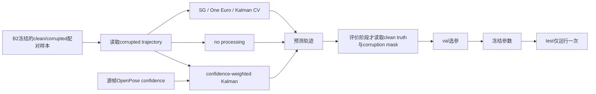

# T07C-B3 传统轨迹优化基线实现指南

## 1. 本阶段回答什么问题

T07C-B3只回答：在不知道合成错误位置、不使用人工mask的条件下，常见传统方法能否从污染观测中恢复更接近clean truth的二维关节轨迹。它不是T07C-B4的质量感知、阶段保持或骨骼约束方法。



所有滤波都在Neck为原点、逐帧肩宽为尺度的归一化坐标上运行。输出像素坐标通过

\[
\hat{\mathbf{x}}^{px}_t=\mathbf{neck}^{px}_t+s_t\hat{\mathbf{x}}^{norm}_t
\]

恢复。clean truth和`corruption_mask`不属于算法输入，只在评价阶段出现。

## 2. 五种方法

### 2.1 Corrupted input / no processing

公式为

\[
\hat{\mathbf{x}}_t=\mathbf{z}_t.
\]

输入是污染观测，输出完全相同。`null`继续为`null`，不填0。它不是滤波器，而是比较其他方法是否真正带来增益的对照。

代码对应：`run_traditional_baselines.py::apply_method`中的`corrupted_input`分支。

### 2.2 Savitzky-Golay

对长度为奇数的对称窗口，用p阶多项式拟合：

\[
\min_{a_0,\ldots,a_p}\sum_{i=-w}^{w}
\left(z_{t+i}-\sum_{k=0}^{p}a_ki^k\right)^2,
\qquad \hat{x}_t=a_0.
\]

它使用当前帧两侧的观测，是离线非因果平滑。B2窗口只有8帧，因此网格只允许窗口3、5、7和阶数2。SG本身不能处理缺失值；实现先对输入观测做离线线性补齐，再用`mode=interp`处理窗口边缘。该补齐只使用corrupted input，不读取truth或mask。

代码对应：`interpolate_observed`、`apply_savitzky_golay`。

参数影响：窗口越大通常降噪越强，但更容易改变真实运动；多项式阶数越高越能贴合局部曲率，也更可能保留噪声。当前阶数固定，避免8帧样本上的过度自由度。

### 2.3 One Euro Filter

低通更新为

\[
\hat{\mathbf{x}}_t=\alpha_t\mathbf{z}_t+(1-\alpha_t)\hat{\mathbf{x}}_{t-1},
\quad
\alpha_t=\frac{1}{1+\tau_t/\Delta t},
\quad \tau_t=\frac{1}{2\pi f_{c,t}}.
\]

速度控制截止频率：

\[
f_{c,t}=f_{min}+\beta\|\widehat{\dot{\mathbf{x}}}_t\|_2.
\]

这是在线因果滤波，只用当前和过去观测。缺失时保持上一滤波状态，不把缺失改成0。`min_cutoff_hz`越低，静止时平滑越强但滞后越大；`beta`越大，快速运动时越容易放宽滤波；`derivative_cutoff_hz`控制速度估计的平滑程度。

代码对应：`smoothing_alpha`、`apply_one_euro`。

### 2.4 Constant-velocity Kalman

状态为

\[
\mathbf{s}_t=[x_t,y_t,v^x_t,v^y_t]^T,
\]

状态转移与观测模型为

\[
\mathbf{s}_{t|t-1}=F\mathbf{s}_{t-1|t-1},\quad
F=\begin{bmatrix}
1&0&\Delta t&0\\0&1&0&\Delta t\\0&0&1&0\\0&0&0&1
\end{bmatrix},
\quad
H=\begin{bmatrix}1&0&0&0\\0&1&0&0\end{bmatrix}.
\]

预测协方差、Kalman增益和更新为

\[
P^-_t=FP_{t-1}F^T+Q,
\quad K_t=P^-_tH^T(HP^-_tH^T+R)^{-1},
\]

\[
\mathbf{s}_t=\mathbf{s}^-_t+K_t(\mathbf{z}_t-H\mathbf{s}^-_t).
\]

实现是在线因果filter，不做RTS smoother。缺失观测只执行predict。`acceleration_noise_std_norm_s2`越大越不信任匀速模型，更跟随观测；`measurement_noise_std_norm`越大越不信任观测，轨迹更平滑；`initial_velocity_std_norm_s`控制初始化速度的不确定性。

代码对应：`cv_process_noise`、`apply_kalman_cv`。

### 2.5 Confidence-weighted Kalman

状态模型与CV Kalman相同，但测量协方差随OpenPose confidence变化：

\[
R_t=\frac{r_0^2}{\max(c_t,c_{min})^\gamma}I_2.
\]

低confidence使`R_t`变大，降低当前观测权重。它仍是在线因果filter。它只读取源OpenPose confidence，不读取人工质量mask、合成污染mask或truth。`r_0`控制基础测量噪声，`gamma`控制置信度的影响强度，`c_min`防止协方差发散。

代码对应：`source_confidence`以及`apply_kalman_cv`的weighted分支。

## 3. 参数选择与数据隔离

参数网格先冻结在`configs/refinement/t07c_b3_baselines.json`。train只输出开发诊断；全部候选都在val上评价，使用

\[
score=0.6\,RMSE^{penalty}_{corrupted,norm}
+0.4\,CRD_{norm}
\]

选择每种方法的一个参数组合。`RMSE^{penalty}`对缺失预测显式使用1.0 norm惩罚；正式RMSE仍保留为`null`，二者不能混写。参数冻结并记录输入SHA-256后，test只运行一次。查看test后禁止改参数、搜索空间、选择公式或B2污染。

## 4. 一条真实样本的完整处理过程

示例是test样本`SYN_0263`：`CLEAN_TEST_011`、RWrist、retract阶段、medium short-missing。源视频帧为235–242，frame 238–239的归一化观测被置为`null`。

缺口clean truth为：

| video frame | clean normalized RWrist |
|---|---|
| 238 | (-0.402638, 0.293046) |
| 239 | (-0.430103, 0.358189) |

五种方法得到：

| 方法 | frame 238输出 | frame 239输出 | corrupted RMSE_norm | clean displacement_norm | coverage |
|---|---|---|---:|---:|---:|
| no processing | null | null | null，penalized=1.0 | 0.000000 | 0.75 |
| SG | (-0.408469, 0.313222) | (-0.415818, 0.331674) | 0.025963 | 0.007542 | 1.00 |
| One Euro | (-0.390415, 0.257710) | (-0.390415, 0.257710) | 0.080837 | 0.028749 | 1.00 |
| Kalman CV | (-0.401693, 0.321379) | (-0.405581, 0.354908) | 0.026606 | 0.002170 | 1.00 |
| confidence-weighted Kalman | (-0.403397, 0.323586) | (-0.408874, 0.359233) | 0.026316 | 0.002402 | 1.00 |

过程解释：no-processing保留缺失；SG利用前后观测离线补齐并平滑；One Euro只能保持过去状态；两种Kalman用先前位置和速度做两次predict。最后评价器才读取clean truth计算误差。这条样本只说明算法机制，不能单独决定方法排名。

## 5. 代码导读

- `run_traditional_baselines.py`：算法、统一dispatch、confidence读取、像素反归一化和唯一test审计。
- `tune_baseline_parameters.py`：展开预注册网格，生成train诊断和全部val候选结果，只由val选择参数。
- `evaluate_refinement_baselines.py`：在预测完成后读取truth和mask，计算位置/导数/coverage指标并分组。
- `expand_parameter_grid`：只展开配置文件中的候选，选中参数必须属于该集合。
- `run_sample`：传给滤波器的参数只有method、corrupted trajectory、配置参数、fps和OpenPose confidence。
- `compute_sample_metrics`：算法完成后才接触truth和mask，是防止oracle泄漏的边界。

## 6. 如何复现

先选参：

```bash
MPLCONFIGDIR=/tmp/humanvla_matplotlib python scripts/trajectory/tune_baseline_parameters.py \
  --config configs/refinement/t07c_b3_baselines.json \
  --dataset data/trajectories/pick_place_pilot_v1_E001/synthetic_corruption_dataset.jsonl \
  --raw-trajectory data/trajectories/pick_place_pilot_v1_E001/raw_upper_limb_trajectory.jsonl \
  --output-search-csv results/trajectories/pick_place_pilot_v1_E001/b3_validation_parameter_search.csv \
  --output-selected-json results/trajectories/pick_place_pilot_v1_E001/b3_selected_parameters.json
```

test审计文件一旦存在，运行器会拒绝第二次test。项目已完成唯一一次运行；不要为了练习直接覆盖正式路径。使用副本数据和全新的临时输出路径才能做教学复跑。

```bash
python -m py_compile scripts/trajectory/run_traditional_baselines.py \
  scripts/trajectory/tune_baseline_parameters.py \
  scripts/trajectory/evaluate_refinement_baselines.py
python scripts/trajectory/run_traditional_baselines.py --help
```

检查重点：搜索CSV应有47行候选；selected JSON必须写`selection_split=val`和`test_status=not_run`；正式预测应为336×5=1680行；test结果应为96×5=480行。

## 7. 常见错误

1. 把truth输入滤波器，再声称是普通基线。这是oracle泄漏。
2. 用人工corruption mask跳过错误帧，会把普通Kalman变成质量感知方法。
3. 把`null`替换为`[0,0]`，会制造巨大且不存在的运动。
4. 只对有输出的short-missing计算误差，会掩盖方法完全未恢复缺口。
5. 在8帧窗口上使用长度9或更大的SG窗口。
6. 把SG写成在线方法；对称窗口需要未来帧。
7. 把因果Kalman结果称为Kalman smoother；本实现没有后向RTS pass。
8. 根据test图重新调参数，即使只改一个阈值也属于泄漏。
9. 把负的real-motion attenuation解释成“负误差”；它表示输出运动被放大。
10. 把本实验外推为跨视频或机器人控制结论；当前只来自E001的within-episode synthetic benchmark。

## 8. 自测问题

1. 为什么clean truth可以用于指标计算，却不能作为滤波器输入？
2. SG为什么是非因果方法？窗口7和窗口3各有什么偏差-方差权衡？
3. One Euro的`beta`增大时，快速运动的延迟通常如何变化？
4. CV Kalman在观测缺失时具体执行哪一步，为什么不需要把缺失填0？
5. confidence-weighted Kalman中的confidence来自哪里，明确不能来自哪里？
6. 为什么selection score需要对缺失预测另设显式惩罚，同时正式RMSE仍保留null？
7. train、val、test在本协议中分别承担什么角色？
8. 为什么B2同phase窗口无法测量真实phase-boundary shift？
9. `clean_region_displacement`很低但corrupted RMSE很高说明了什么？
10. 若test上发现另一个参数更好，下一步应该如何报告，而不是如何偷偷调参？

